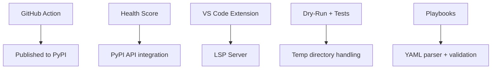

# Priority Features for Next Release

This document outlines the highest-impact features prioritized for near-term implementation. These features were selected based on:

1. **User Value** - Direct impact on Python developer experience
2. **Differentiation** - Sets Codeshift apart from alternatives
3. **Implementation Feasibility** - Reasonable effort with existing architecture
4. **Revenue Potential** - Drives adoption and upgrades to paid tiers

---

## Tier 1: Critical (Implement First)

### 1. GitHub Action for Automated Migration PRs

**Why Critical:** This is the primary distribution channel. Developers discover tools through GitHub Actions marketplace and automated PRs in their repos.

**Value Proposition:**
- "Set it and forget it" - automatic weekly/daily migration PRs
- Integrates with existing Dependabot/Renovate workflows
- Creates viral loop: devs see Codeshift PRs in open source, adopt for their projects

**Technical Scope:**
```
codeshift/
├── action/
│   ├── action.yml           # GitHub Action metadata
│   ├── entrypoint.sh        # Docker entrypoint
│   └── Dockerfile           # Action container
```

**Acceptance Criteria:**
- [ ] Action creates branch and applies migrations
- [ ] PR includes detailed changelog and risk assessment
- [ ] Runs tests if configured
- [ ] Supports `tier1-only` mode (free) and full mode (requires API key)
- [ ] Auto-merge option for low-risk Tier 1 migrations
- [ ] Published to GitHub Marketplace

**Estimated Effort:** 2-3 days

---

### 2. Codebase Health Score

**Why Critical:** Creates ongoing engagement and surfaces upsell opportunities. Developers come back regularly to check their score.

**Value Proposition:**
- Quantified technical debt visibility
- Motivates proactive maintenance
- Gamification drives engagement
- Reports are shareable (team buy-in)

**Technical Scope:**
```
codeshift/
├── cli/commands/
│   └── health.py            # New CLI command
├── analyzer/
│   └── health_scorer.py     # Scoring engine
└── reports/
    ├── generator.py         # Report generation
    └── templates/           # HTML/JSON templates
```

**Scoring Algorithm:**
```python
class HealthScore:
    dependency_freshness: float  # 0-100, weight: 30%
    security_score: float        # 0-100, weight: 25%
    migration_readiness: float   # 0-100, weight: 20%
    test_coverage: float         # 0-100, weight: 15%
    type_coverage: float         # 0-100, weight: 10%

    @property
    def total(self) -> float:
        return (
            self.dependency_freshness * 0.30 +
            self.security_score * 0.25 +
            self.migration_readiness * 0.20 +
            self.test_coverage * 0.15 +
            self.type_coverage * 0.10
        )
```

**Acceptance Criteria:**
- [ ] `codeshift health` shows terminal summary with color-coded score
- [ ] `codeshift health --report html` generates shareable report
- [ ] `codeshift health --ci --threshold 70` exits non-zero for CI gating
- [ ] Integrates with PyPI to check version freshness
- [ ] Checks known vulnerability databases

**Estimated Effort:** 3-4 days

---

### 3. Deprecation Early Warning System

**Why Critical:** Transforms Codeshift from reactive to proactive tool. No competitor does this well.

**Value Proposition:**
- Prevents emergency migrations
- Gives teams planning time
- Creates regular touchpoints with users
- Surfaces migration opportunities proactively

**Technical Scope:**
```
codeshift/
├── cli/commands/
│   ├── watch.py             # Start monitoring
│   └── deprecations.py      # List warnings
├── watcher/
│   ├── deprecation_db.py    # Known deprecation patterns
│   ├── scanner.py           # Code scanner for patterns
│   └── notifier.py          # Notification system
```

**Deprecation Database Schema:**
```yaml
# codeshift/watcher/deprecation_db/pydantic.yaml
deprecations:
  - pattern: "class Config:"
    context: "inside BaseModel subclass"
    deprecated_in: "2.0"
    removed_in: null
    severity: warning
    message: "Inner Config class is deprecated, use model_config = ConfigDict(...)"
    link: "https://docs.pydantic.dev/latest/migration/#changes-to-config"

  - pattern: "@validator"
    deprecated_in: "2.0"
    removed_in: "3.0"  # Predicted
    severity: info
    message: "@validator is deprecated, use @field_validator"
```

**Acceptance Criteria:**
- [ ] `codeshift deprecations` scans and lists all deprecated patterns
- [ ] Severity levels: INFO, WARNING, CRITICAL
- [ ] Estimated timeline to breakage
- [ ] `codeshift watch` runs in background (optional daemon mode)
- [ ] JSON output for CI integration

**Estimated Effort:** 4-5 days

---

## Tier 2: High Priority (Implement Soon)

### 4. VS Code Extension (Basic)

**Why High:** IDE is where developers spend their time. Inline warnings drive adoption.

**Minimum Viable Features:**
- [ ] Inline squiggle warnings for deprecated patterns
- [ ] Quick-fix suggestions (Cmd+.)
- [ ] Status bar showing migration availability
- [ ] Command palette: "Codeshift: Scan", "Codeshift: Upgrade"

**Technical Approach:**
- Language Server Protocol (LSP) for cross-IDE potential
- Leverage existing CLI as backend
- Communicate via JSON-RPC

**Estimated Effort:** 1-2 weeks

---

### 5. Dry-Run with Test Execution

**Why High:** Builds confidence in migrations. Fear of breaking tests is #1 adoption blocker.

**CLI Interface:**
```bash
codeshift upgrade pydantic --dry-run --run-tests
```

**Features:**
- [ ] Apply migrations to temp directory or in-memory
- [ ] Run pytest against migrated code
- [ ] Correlate test failures with specific transforms
- [ ] Suggest additional fixes for test failures
- [ ] Report: "X/Y tests pass after migration"

**Technical Approach:**
```python
class DryRunExecutor:
    def execute(self, library: str, run_tests: bool) -> DryRunResult:
        with TemporaryMigrationContext() as ctx:
            # Copy files to temp
            ctx.copy_source_files()

            # Apply migrations
            results = self.migration_engine.migrate(ctx.temp_dir)

            if run_tests:
                # Run tests in temp environment
                test_result = self.test_runner.run(ctx.temp_dir)
                results.test_summary = test_result

            return results
```

**Estimated Effort:** 3-4 days

---

### 6. Migration Playbooks (Custom Rules)

**Why High:** Enterprise customers need this for internal libraries. Key differentiator.

**Minimum Viable Features:**
- [ ] YAML-based rule definition
- [ ] Pattern → replacement transforms
- [ ] Import from file path
- [ ] Basic validation command

**Playbook Format (v1):**
```yaml
name: internal-sdk-v2
library: internal-sdk
from_version: "1.*"
to_version: "2.0"

rules:
  - name: client-rename
    type: rename
    old: "internal_sdk.Client"
    new: "internal_sdk.SDKClient"

  - name: method-async
    type: signature
    pattern: "client.fetch(*)"
    replacement: "await client.fetch(*)"
```

**CLI Interface:**
```bash
codeshift playbook validate ./playbooks/internal-sdk.yaml
codeshift upgrade internal-sdk --playbook ./playbooks/internal-sdk.yaml
```

**Estimated Effort:** 1 week

---

### 7. Test Migration Transforms

**Why High:** Tests are often forgotten, causing migration failures even when source code is migrated.

**Scope:**
- Extend existing transformers to handle test patterns
- Detect test files automatically (test_*.py, *_test.py)
- Migrate fixtures, assertions, mocks

**Patterns to Handle:**
```python
# Fixtures using old APIs
@pytest.fixture
def model():
    return Model.parse_obj(data)  # → Model.model_validate(data)

# Assertions on old methods
assert obj.dict() == expected  # → assert obj.model_dump() == expected

# Mocks targeting old paths
@patch("myapp.models.Model.dict")  # → @patch("myapp.models.Model.model_dump")
```

**Estimated Effort:** 3-4 days per library

---

## Tier 3: Medium Priority (Plan for Later)

### 8. Interactive Migration Mode (TUI)

Textual/Rich-based TUI for per-change accept/reject workflow.

### 9. Monorepo Support

Auto-detect project structure, shared-first migration ordering.

### 10. Configuration File Migration

Migrate pyproject.toml, settings.py, etc. alongside Python code.

### 11. Security Vulnerability Auto-Fix

Integrate with PyPI Advisory Database, auto-fix security vulns.

---

## Implementation Order

```
Week 1-2:
├── GitHub Action (Critical #1)
└── Health Score (Critical #2)

Week 3-4:
├── Deprecation Warnings (Critical #3)
└── Dry-Run + Tests (High #5)

Week 5-6:
├── VS Code Extension basic (High #4)
└── Test Migration (High #7)

Week 7-8:
└── Migration Playbooks (High #6)
```

---

## Success Metrics

| Feature | Success Metric | Target |
|---------|---------------|--------|
| GitHub Action | Installs from Marketplace | 500 in first month |
| Health Score | Weekly active users running health | 30% of CLI users |
| Deprecation Warnings | Issues caught before breaking | Track in telemetry |
| VS Code Extension | Extension installs | 1000 in first month |
| Dry-Run + Tests | Migrations with tests enabled | 40% of migrations |

---

## Dependencies



---

*Document created: 2026-02-01*
*Review scheduled: Weekly during standup*
